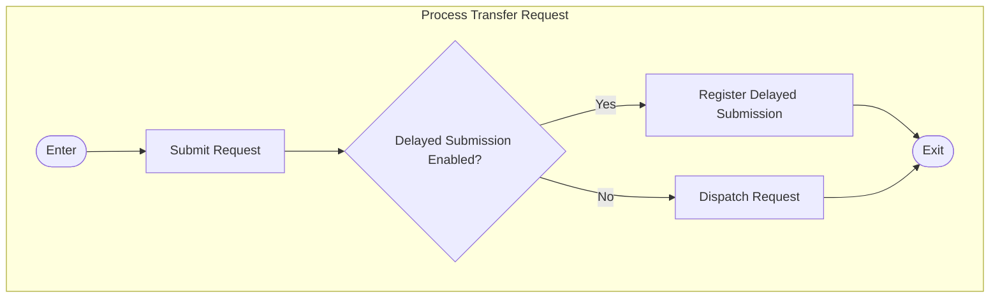
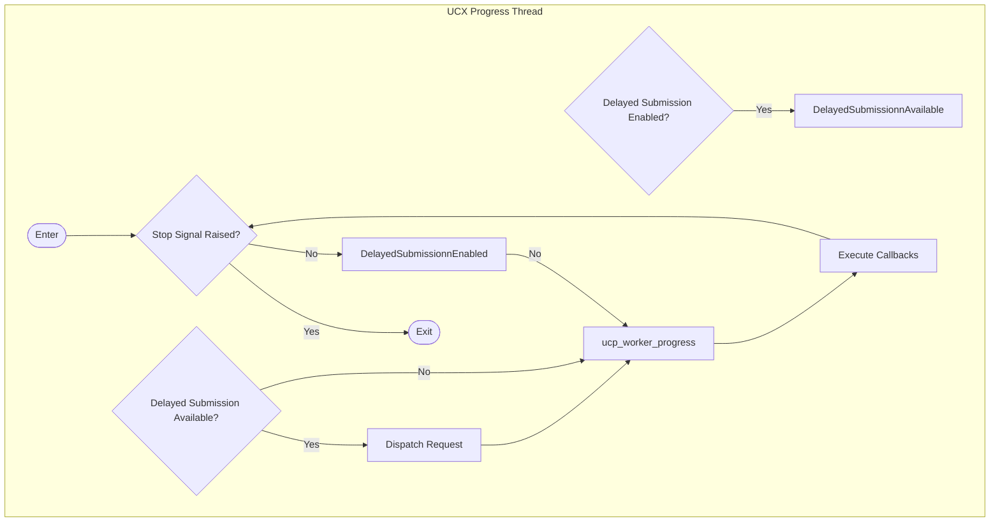
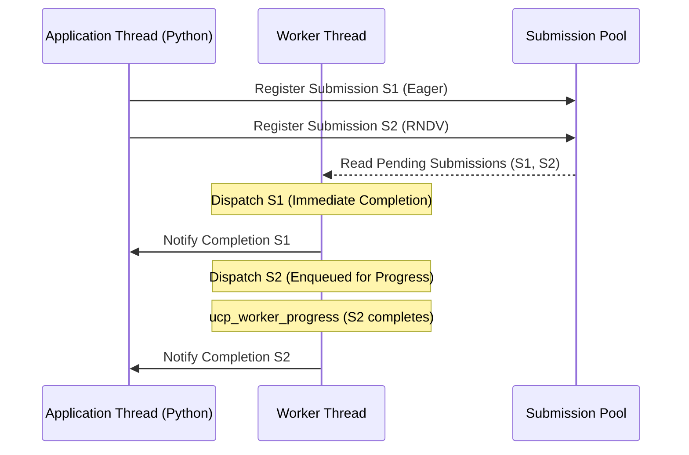
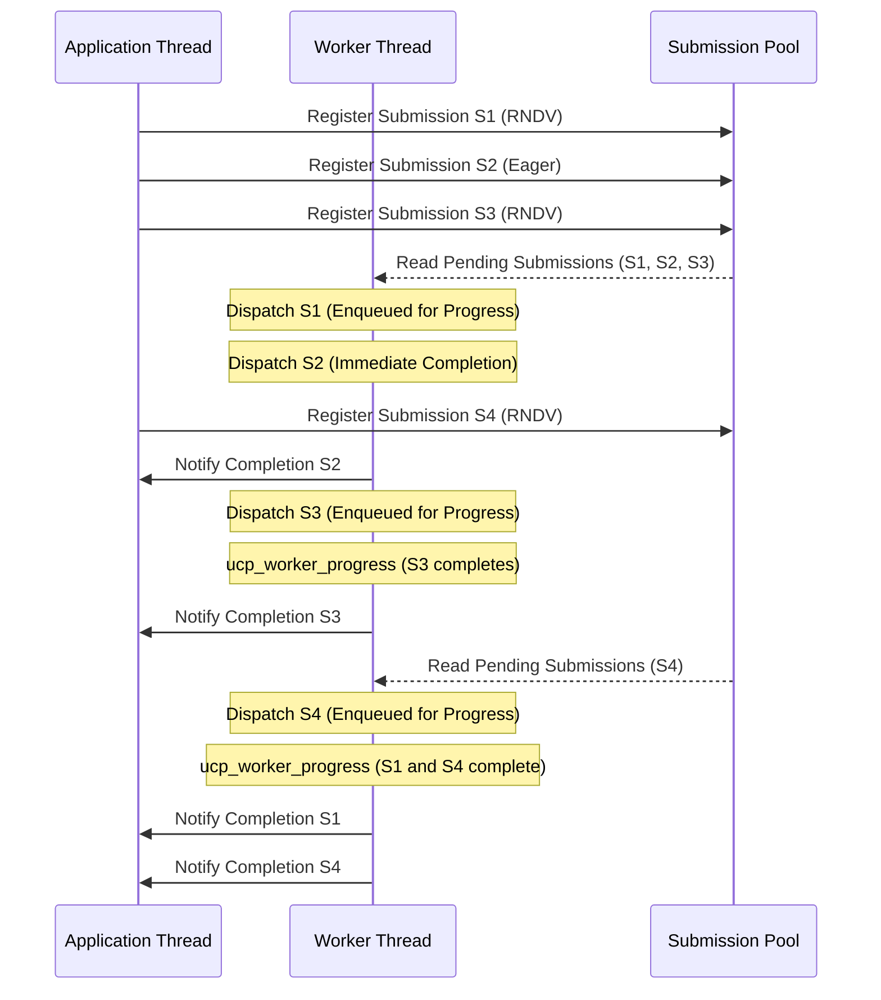
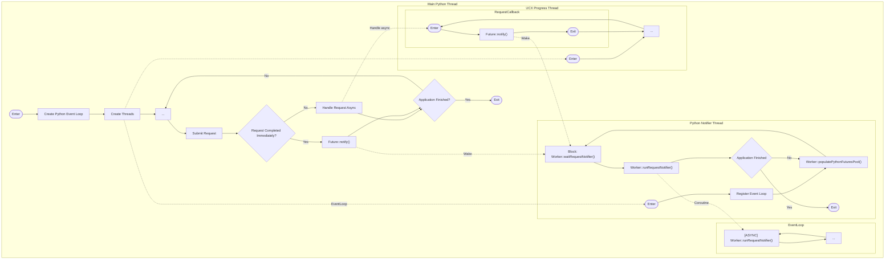
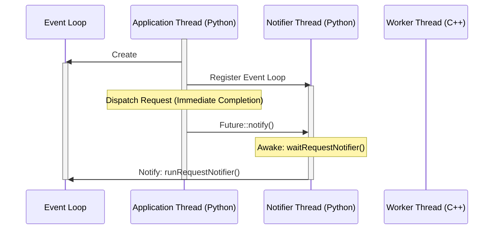
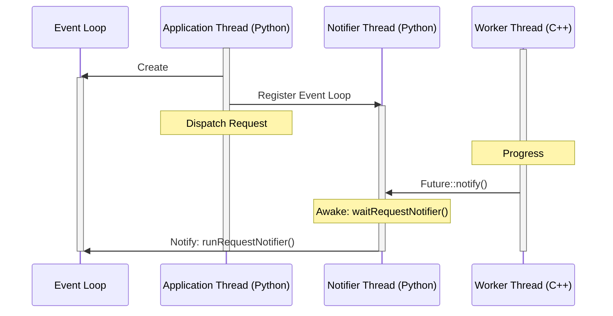
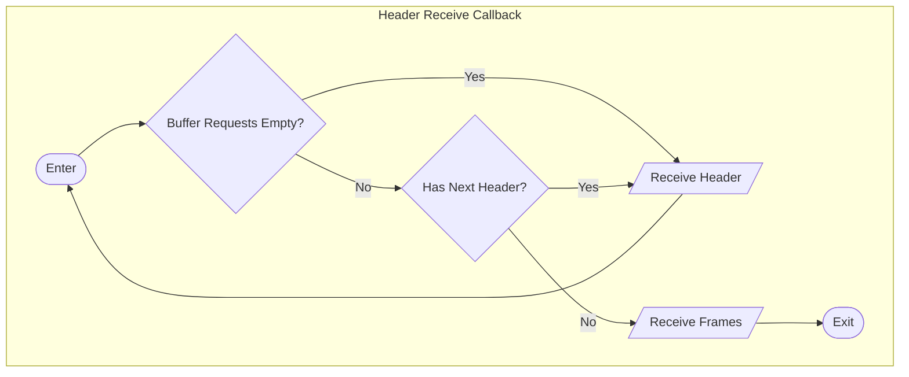
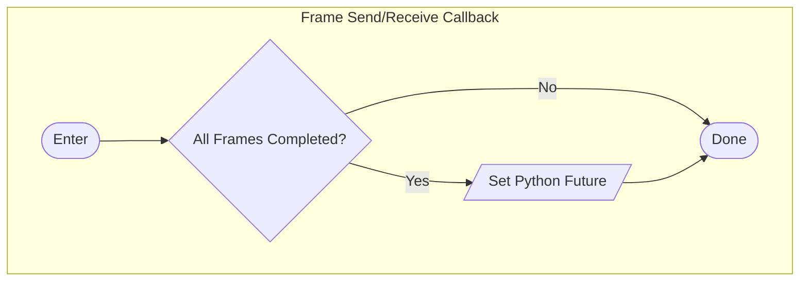

# Optimizations

This is a list of built-in optimizations in UCXX. Most of them target Python usage, but may be useful in C++ applications depending on their design and needs.

## Delayed Submission

Move transfer submissions (``ucp_{tag,stream}_{send,recv}_nb)``) to the worker progress task.

Most times UCX applications will submit transfer requests immediately from the application thread, returning a ``ucs_status_ptr_t`` which is then checked for immediate completion or not, in the latter case a callback will execute once that completes during some ``ucp_worker_progress()`` call. When writing Python bindings for C/C++ code, it is often good practice to release the GIL instead of holding it while the C/C++ code runs, and thus allowing other threads to acquire the GIL while the low-level piece of code executes. For UCXX that would mean the GIL would be released and then reacquired by the C++ code almost instantaneously, or not released at all. To prevent that, UCXX allows submitting a transfer request intent, while delaying the ``ucp_{tag,stream}_{send,recv}_nb`` request for a future time, for example, during the worker progress task.

The UCX requests also require the UCX spinlock to be acquired. If there is a worker progress task running, this would effectively mean the application thread and the worker progress thread competing for the UCX spinlock simultaneously. Now, if one of the threads has hold of the UCX spinlock and tries to achieve also the GIL while the other thread has the GIL but attempting to acquire the UCX spinlock, that would lead to a deadlock. The solution for this problem in UCXX is to prevent the application thread from ever (or almost ever) acquiring the UCX spinlock, while preventing the worker progress thread from acquiring the GIL. This last problem is solved by using a `Notifier Thread`.

### Flowchart

To help understanding delayed submission execution, we have two flowcharts to illustrate the process. First we see how a transfer request is processed:



Second, we look at the flowchart for the UCX progress thread:



### Sequence Diagram

It may also be helpful to understand the execution order via a couple of examples in the form of sequence diagrams. To begin with, a simple case might look as follows:



A more complex sequence might look as the example below:



Please note that both examples above simply illustrate one possible sequence, as asynchronous behavior may occur in a different order depending on several variables, such as latency and rendezvous threshold.

### Enable/Disable

- C++: can be disabled via ``UCXXWorker`` constructor passing ``enableDelayedSubmission=false`` (default: ``true``);
- Python sync: can be disabled via ``UCXWorker`` constructor passing ``enable_delayed_submission=False`` (default: ``True``);
- Python async: can be disabled via environment variable ``UCXPY_ENABLE_DELAYED_SUBMISSION=0`` (default: ``1``);

## Notifier Thread

The Notifier Thread is a thread launched from Python that must share the same ``asyncio`` event loop of the main application thread. The thread is used to notify a ``UCXRequest`` Python ``Future`` of its completion, avoiding the worker progress function from requiring GIL acquisition. Although being a separate thread from the main application thread, this will require the GIL exclusively while setting the ``Future`` result/exception and will block the main thread (unless the main thread is doing something that doesn't require the GIL either) during that short period, but will avoid additional ``asyncio`` tasks from flooding the application thread and executing more Python code than absolutely necessary.

The ``NotifierThread`` runs a loop in Python that shall have the following sequence:

1. Populate Python ``Future`` pool (no-op if pool has more objects available than pre-defined);
2. Block while waiting (implemented as a ``std::condition_variable``) for one (or more) ``UCXXRequest`` to complete and be notified by ``UCXXWorker``;
3. Run request notifier (implemented in C/C++ via CPython functions) as an ``asyncio`` coroutine -- required to ensure the event loop is notified of the ``Future`` completion;

Sample thread target function:

```python
    async def _run_request_notifier(worker):
        worker.run_request_notifier()

    def _notifierThread(event_loop, worker):
        # Set thread's event loop to the same used in main thread
        asyncio.set_event_loop(event_loop)

        while True:
            # Populate ``Future`` pool -- no-op if holding more than threshold
            worker.populate_python_futures_pool()

            # Blocks until worker progress function notifies of one
            # (or more) UCXXRequest completion
            finished = worker.wait_request_notifier()
            # If worker is shutting down, return
            if finished:
                return

            # Create task to notify all enqueued waiting futures
            # Note: a task must be created from a coroutine
            task = asyncio.run_coroutine_threadsafe(
                _run_request_notifier(worker), event_loop
            )

            # Wait until async task completes
            try:
                task.result()
            except Exception as e:
                print(f"task.result() error {type(e)}: {e}")
```

### Flowchart

Arguably, this is a very complex process, involving 3 threads executing different parts of the entire workflow. The flowchart below may help on better understanding the description provided above.



### Sequence Diagram

It may also be helpful to understand the notifier thread with a couple of sequence diagrams. One such case is when a transfer completes immediately, this is the simplest case and exemplified by the diagram below:



A second case is when the transfer does not complete immediately and must be progressed and further notified from the worker thread, this process is shown in the following diagram:



### Enable/Disable

Given UCXX C++ layer is Python-agnostic, it must be possible to disable all the Python-specific code at compile-time. Notifying Python ``Future`` can be enabled at C++ compile time via the ``-DUCXX_ENABLE_PYTHON=1`` definition, which is default for ``setuptools`` builds. When ``-DUCXX_ENABLE_PYTHON=0``, all notification happens via coroutines that continuously check for completion of a ``UCXXRequest`` and yield for other async tasks, which tend to be CPU-intensive.

## Multi-buffer Transfers

Applications like Dask often must send/receive multiple buffers for a single read or write operation. Generally, it's necessary to follow the order below:

1. Send/receive number of frames;
2. Send/receive size and type (host or CUDA) of each frame;
3. Send/allocate-and-receive each frame.

This results in at least 3 send/receive operations, and potentially more when multiple buffers are transferred. To avoid submitting multiple async operations and then waiting on each one individually, UCXX introduces a new ``tag_send_multi``/``tag_recv_multi`` API to simplify that and reduce Python overhead.

On the sender side it works by assembling a ``Header`` object with a pre-defined size (currently ``100`` frames) combining the number of frames included, whether there is a next ``Header`` (in case the number of frames is larger than the pre-defined size), the buffer pointers, buffer types (host or CUDA) and buffer sizes. The ``Header`` is then sent as a single ``tag`` message, followed by all buffers in the order in which each buffer appears in the ``Header``.

The receiver side will always begin by waiting for a ``Header`` of that pre-defined size and parse it. If there's a next ``Header`` it will then wait for it until no more ``Header`` objects are expected. Then it will parse the ``Header``, and looping through each buffer described in the ``Header`` it will allocate memory for that buffer, followed by a ``tag_recv_nb`` operation to receive on that buffer. Note that unlike single-buffer transfers, the receiver side has no way of knowing buffer types/sizes in advance, so allocation can't be done in advance by the user and must be dealt with internally.

### Supported Buffer Types

Currently, only two types of buffers are supported: host and CUDA. Host buffers are defined in ``UCXXPyHostBuffer`` and are allocated via regular ``malloc`` and released via ``free``. CUDA buffers are defined in ``UCXXPyRMMBuffer``, and as the name suggests it depends on RMM, allocation occurs via ``rmm::device_buffer`` and release occurs when that object goes out-of-scope as implemented by ``rmm::device_buffer`` destructor.

Once ``get()`` is called by the user, the buffer is released and it's the user's responsibility to handle its release. The Cython ``UCXBufferRequest`` interface that converts ``UCXXPyHostBuffer``/``UCXXPyRMMBuffer`` into equivalent ``numpy.ndarray``/``rmm.DeviceBuffer`` ensures the resulting Python object will release the buffer once its reference count goes to zero.

### Flowchart

To help understanding multi-buffer transfers, we have a few flowcharts to illustrate the process in three parts. We begin by looking at multi-receive and multi-send procedures:

```mermaid
  flowchart TD
    SendEnter([Enter])
    CreateHeader[Create Header]
    SendHeader[/Send Header/]
    SendHasNextHeader{Has Next Header?}
    SendFrame[/Send Frame/]
    SendFramesCompleted{All Frames Sent?}
    SendExit([Exit])

    RecvEnter([Enter])
    RecvHeader[/Receive Header/]
    RecvHasNextHeader{Has Next Header?}
    RecvAllocateBuffer[Allocate Buffer]
    RecvFrame[/Receive Frame/]
    RecvFramesCompleted{All Frames Received?}
    RecvExit([Exit])

    subgraph TMS[tagMultiSend]
    SendEnter-->CreateHeader
    CreateHeader-->SendHeader
    SendHeader-->SendHasNextHeader
    SendHasNextHeader-->|Yes| CreateHeader
    SendHasNextHeader-->|No| SendFrame
    SendFrame-->SendFramesCompleted
    SendFramesCompleted-->|Yes| SendExit
    SendFramesCompleted-->|No| SendFrame
    end

    subgraph TMR[tagMultiRecv]
    RecvEnter-->RecvHeader
    RecvHeader-->RecvHasNextHeader
    RecvHasNextHeader-->|Yes| RecvHeader
    RecvHasNextHeader-->|No| RecvAllocateBuffer
    RecvAllocateBuffer-->RecvFrame
    RecvFrame-->RecvFramesCompleted
    RecvFramesCompleted-->|Yes| RecvExit
    RecvFramesCompleted-->|No| RecvAllocateBuffer
    end
```



The charts above describe how the actual transfers happen. However, we also need to understand the flow for sending and receiving headers describing the actual data being transferred. We see that in the chart below.



The final step is to look at the callbacks for sending and receiving frames, as shown below.



### Enable/Disable

Since multi-buffer transfers are a new feature in UCXX and do not have an equivalent in neither UCX or UCX-Py, it requires a new API. The new API is composed of ``Endpoint.send_multi(list_of_buffers)`` and ``list_of_buffers = Endpoint.recv_multi()``.
