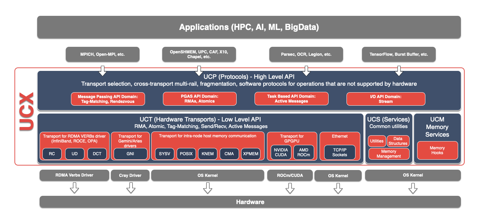

UCXX
====

UCXX is the Python interface for `UCX <https://github.com/openucx/ucx>`_, a low-level high-performance networking library. UCX and UCXX support several transport methods including InfiniBand and NVLink while still using traditional networking protocols like TCP.

.. toctree::
   :maxdepth: 1
   :hidden:

   user_guide.rst
   help_and_reference.rst
   api.rst
   glossary.rst
